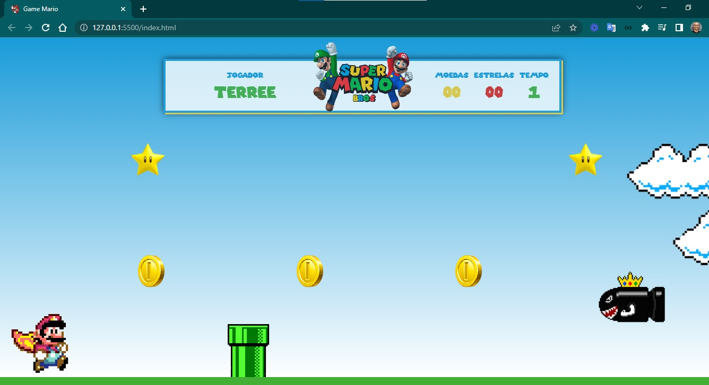
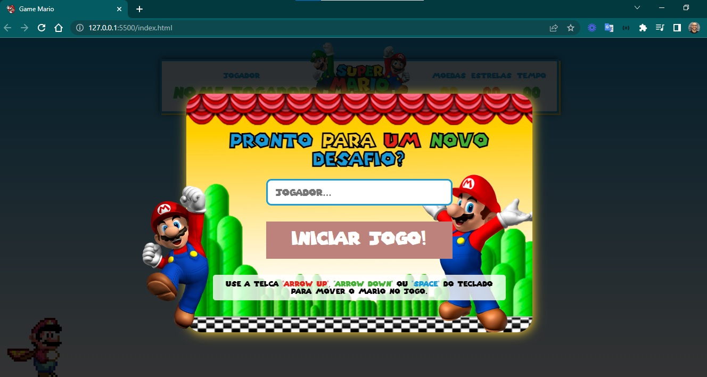
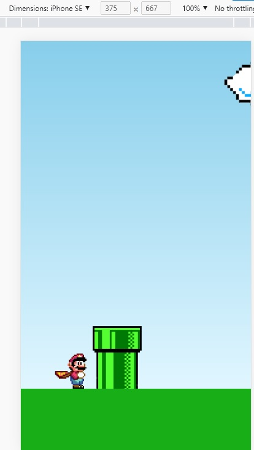

<h4 align="center"> 
	🚧 Game Mario 🚀
</h4>

<h1 align="center">
    
</h1>

- Projeto de um Game do Mário.

#### Requisitos

- [ ] design personalizado
- [ ] responsividade: jogar em desktop, jogar em mobile.
- [x] favicon

#### Funcionalidades

#### v0.0
- [x] frente, trás, agachar, pular
- [x] morrer nos obstáculos

#### v1.0
- [x] o jogador informa o nome a ser salvo
- [x] botão de play para iniciar o jogo
- [x] ter um time crescente de jogo
- [x] capturar moedas

#### v2.0
- [ ] mudar cenário depois de um tempo
- [ ] reduzir velocidade da fase
- [ ] aumentar velocidade da fase
- [ ] quando perder a partida deve exibir uma tela de game over
- [ ] exibir o ranking com os resultados de jogo com nome, moedas e tempo

#### warning
- [ ] [para corrigir](https://www.youtube.com/watch?v=nB_mvtTAwmM)

#### Branches

- [x] v0.0-developer: código inicial
- [ ] v1.0-zeus: funcionalidades 

#### Tools

- [x] Extensão Live Server no VSCode

#### Telas

- Desktop

    
    

- Mobile

    

#### Inspirações para aperfeiçoamentos  

- Jogo para desktop e para mobile
- [Vídeos](https://www.youtube.com/@DarlanPAraujo)