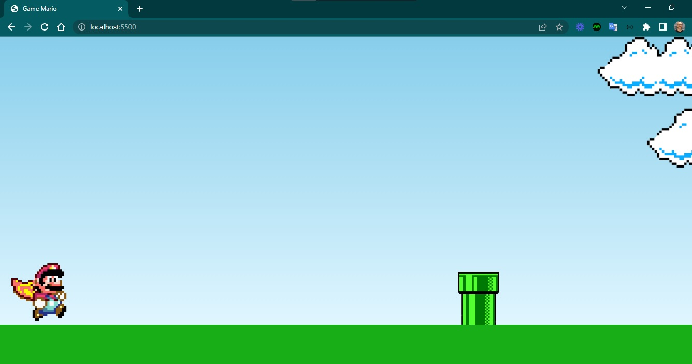

<h4 align="center"> 
	🚧 Game Mário 🚀
</h4>

<h1 align="center">
    
</h1>

- Projeto de um Game do Mário.

#### Requisitos

- [ ] design personalizado
- [ ] responsividade: jogar em desktop, jogar em mobile.
- [ ] favicon
- [ ] criar mais funcionalidades

#### Telas

- Desktop

    

- Mobile

    

#### Inspirações para aperfeiçoamentos  

- Jogo para desktop e para mobile